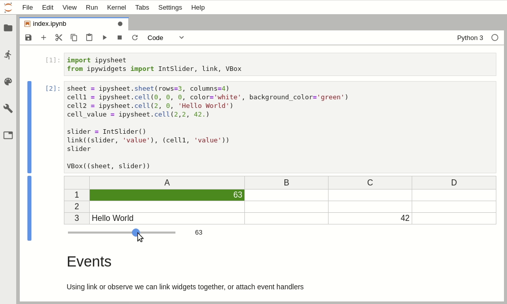
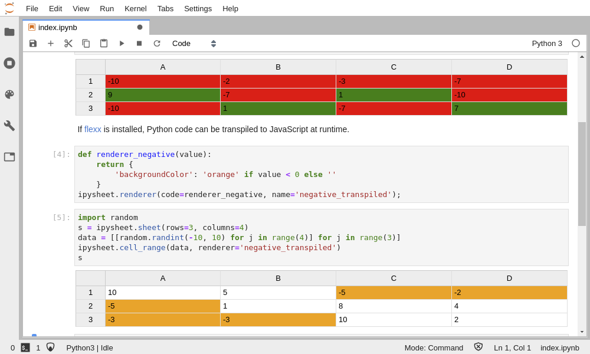
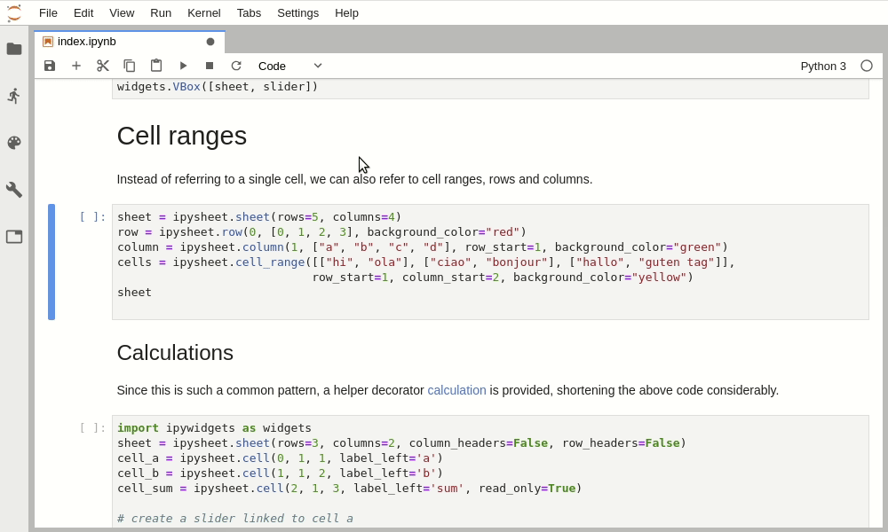

# ipysheet

Spreadsheet in the Jupyter notebook:

   * Try it out using binder: [](https://mybinder.org/v2/gh/QuantStack/ipysheet/stable?filepath=docs%2Fsource%2Findex.ipynb)
   * Or check out the documentation at https://ipysheet.readthedocs.io/

**Create a table and drive a value using ipywidgets:**



**Perform a calculation on slider change:**


**Change cell style depending on the value using renderers:**



**Populate table using cell ranges:**



# Installation

With conda:

```
$ conda install -c conda-forge ipysheet
```

With pip:

```
$ pip install ipysheet
```

To make it work for Jupyter lab:
```
$ jupyter labextension install ipysheet
```

If you have notebook 5.2 or below, you also need to execute:
```
$ jupyter nbextension enable --py --sys-prefix ipysheet
```

For a development installation (requires npm),

```
$ git clone https://github.com/QuantStack/ipysheet.git
$ cd ipysheet
$ pip install -e .
$ jupyter nbextension install --py --symlink --sys-prefix ipysheet
$ jupyter nbextension enable --py --sys-prefix ipysheet
$ jupyter labextension link js
```

For Jupyter lab development, you may want to start Jupyter lab with `jupyter lab --watch` so it instantly picks up changes.
